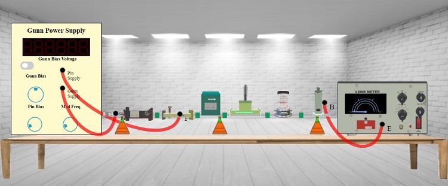

## Procedure 

To perform the experiment follow the steps:  
  
**Step-1:** Click on Components button for components to pop up.  
  
**Step-2:** Click on the "Components", drag them to the test bench and place them as shown in fig. 1.  
  

**Fig. 1 Bench setup for V-I Characteristics of Gunn Diode**

  
**Step-3:** After placing the components on the test bench, connect the wires accordingly.  
  
**Step-4:** If your connections are correct then you may continue to take down the readings, if not then click on "Reset Button" and try it again.  
  
**Step-5:** Move the "Gunn Bias" knob and set it to 0.5 or above to record your readings.  
  
**Step-6:** Toggle the switch button to get the value of Gunn Diode Current.  
  
**Step-7:** Click on Add to table to take down the values of Gunn Bias Voltage and Gunn Diode Current.  
  
**Step-8:** Toggle the switch button again for Gunn Bias Voltage and move the "Gunn Bias" knob for different reading.  
  
**Step-9:** Repeat the process for almost 7 different readings as you did for the first reading.  
  
**Step-10:** Click on "Plot" button to plot a graph as per your readings.  
  
**Step-11:** If you want to save the graph click on the camera icon just above the graph.  
  
**Step-12:** If you want to take down more readings, then click on "Close" Button.  
  
**Step-13:** And repeat the same process to take down the readings as you did for the first reading.  
  
**Step-14:** Click on "Print" button to print your current page (readings and connections) or to save your page (readings and connections) in a PDF form. After clicking on "Print Button" set the layout as "Landscape" to get a proper view of the page then go to more settings and click on the checkbox named "Background graphics".

