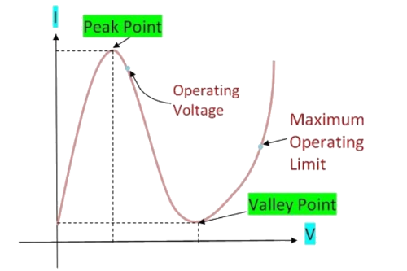
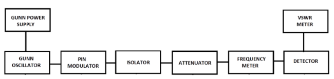

### Introduction

The Gunn Oscillator is based on negative differential conductivity effect in bulk semiconductor which has two conduction bands, minima separated by an energy gap. A disturbance at the cathode gives rise to high field region which travel towards the anode. When this high field domain reaches the anode, it disappears and another domain is formed at the cathode and starts moving towards anode and so on. The time required for domain to travel from cathode to anode gives oscillation frequency. In a Gunn Oscillator, the Gunn diode is placed in a resonant cavity, the Oscillation frequency is determined by cavity dimension than by diode itself.  

#### Modes of Operation of Gunn Diode
The operation of a Gunn diode can be done in four modes which include the following.

* Gunn Oscillation Mode
* Stable Amplification Mode
* LSA Oscillation Mode
* Bias Circuit Oscillation Mode

#### V-I Characteristics of Gunn Diode
    
The Current in Gunn diode starts increasing initially with the applied DC voltage. At a particular point, the current starts decreasing this point is called threshold point or peak point.

 

 

**Fig. 1 V-I characteristics of Gunn diode**

After crossing threshold point the current starts decreasing and this creates negative resistance region in the diode. Due to this negative resistance region, the diode acts as amplifier and oscillator. In this negative resistance region, the Gunn diode is able to amplify the signals.

#### Block Diagram
    

**Fig. 2 Bench setup for V-I characteristics of Gunn diode**

#### Advantages of Gunn diode

* Portable and Small Size device.
* The cost of manufacturing of Gunn diode is low.
* It possesses better noise to signal ratio as it is immune from noise disturbance.
* The Gunn diode is reliable and stable at higher frequencies.
* It has a high bandwidth of operation.

#### Disadvantages of Gunn Diode

* The Gunn diode has poor temperature stability.
* The device operating current is higher and therefore power dissipation is more.
* The efficiency of Gunn Diode is low below 10GHz.

